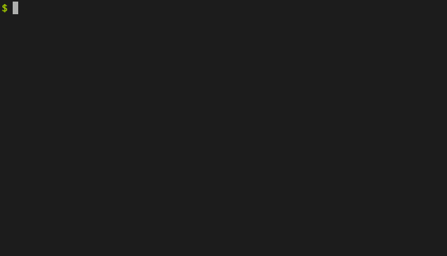

特定のバージョンのシェルで検証したい。また、新しいシェルがリリースされたが、パッケージ管理ではまだ配布されない。
そんなシェルのバージョンを気にするシェルスクリプト開発者のために、ローカル環境に特定のシェルをインストールできる、シェルのバージョンマネージャを作りました。

<iframe src="/github/#ueokande/shvm" title="ueokande/shvm" class="external-service-frame" scrolling="no"></iframe>


基本的なコンセプトは、rvmやnvmと似ています。

インストール方法
----------------

shvmはPOSIX互換のシェルで動きます。あと必要なものは、gitとシェルのコンパイル環境（C、C++のコンパイラ、makeやautoconfなど、インストールするシェルのバージョンによる）のみです。

shvmのインストールは、GitHubからcloneして

```sh
git clone https://github.com/ueokande/shvm $HOME/.bashvm
```

シェル起動時に読まれるファイル（`.bash_profile`, `.zprofile`, `.profile` など）に次の一行を加えるだけです。

```sh
[ -r $HOME/.shvm/profile ] && . $HOME/.shvm/profile
```

シェルのインストールから起動まで
--------------------------------

次の例はshvmを使ったインストールから起動までの一連の流れです。

```sh
# インストール可能なbashを表示
shvm list remote bash

# bash-2.0をインストール
shvm install bash-2.0

# bash-2.0にパスを通す
shvm use bash-2.0

# インストールされたシェルと現在使用可能なシェルを表示
shvm list local

# bash-2.0を起動
bash --version
```

他のシェルを使いたい場合
------------------------

bash以外のシェルも利用できます。次の例は、fishをインストールして利用する例です。

```sh
# サポートされているシェルを表示
shvm list support

# インストール可能なfishを表示
shvm list remote fish

# fish-2.0.0をインストールしてパスを通す
shvm use --install fish-2.0.0

# fish-2.0.0を起動
fish --version
```

shebangに書く
------------

`shvm use` されたシェルはパスが通るので、shebangからも利用できます。シェルのパスは`env`を利用して解決します。

```sh
#!/usr/bin/env

echo $SHELL
```

例えばCI上で様々なシェルのバージョンでテストを実行したい場合に役に立ちます。


shvmの今後の開発
----------------

現在、インストール可能なシェルはbash、fish、tcsh、zshの4つのみなので、他のシェルもサポートします。
